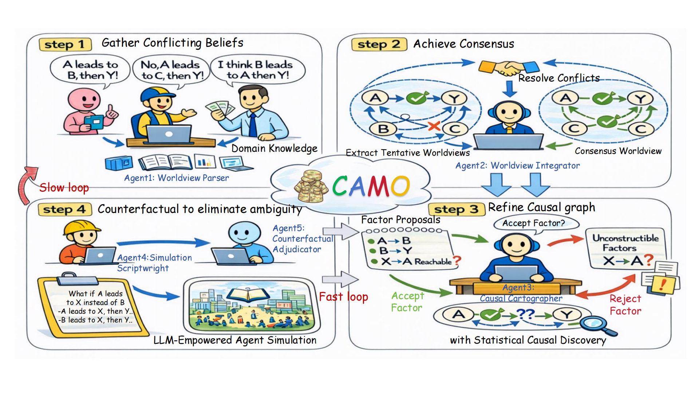

# CAMO: LLM智能体模拟中从微观行为到宏观涌现的自动化因果发现框架

[English](README.md) | [简体中文](README_zh.md)

## 📖 简介

CAMO (Causal discovery from Micro behaviors to Macro Emergence in LLM agent simulations) 是一个自动化的因果发现框架，用于在大语言模型 (LLM) 驱动的智能体模拟中，识别从微观智能体行为到宏观涌现机制的因果关系。

CAMO 通过整合非结构化的文本先验知识、观测数据以及模拟器内部的反事实干预，自动恢复连接微观智能体行为、中观交互结构到宏观涌现结果的因果机制，支持解释与干预。

## 📊 CAMO 概览



## 🎯 主要特性

- **自动化因果发现**：自动从 LLM 驱动的多智能体模拟中发现微观到宏观的因果结构
- **多智能体协作**：采用多个专用智能体协同工作，实现世界观构建、冲突调解、因果制图、实验设计和反事实验证
- **快慢自进化循环**：通过快慢循环机制减轻先验幻觉和嘈杂干预的影响，实现可靠的因果分析
- **局部因果识别**：专注于目标涌现结果周围最小但足够的因果接口，而非完整的全局因果图
- **可解释的因果链**：提供从上游微观/中观原因到目标结果的清晰因果解释路径
- **马尔可夫边界恢复**：使用类似 IAMB 的算法恢复可计算的马尔可夫边界
- **真实互信息估计**：使用基于 k 最近邻的 KSG 估计器计算条件互信息
- **反事实边定向**：使用反事实干预来定向模糊的因果边

## 📁 项目结构

```
CAMO/
├── method/                    # 核心方法模块
│   ├── agents/               # 多智能体系统
│   │   ├── WorldviewAnalysisAgent.py          # A1: 世界观分析智能体
│   │   ├── ConflictMediationAgent.py          # A2: 冲突调解智能体
│   │   ├── CausalCartographAgent.py           # A3: 因果制图智能体
│   │   ├── ScriptCraftsman.py                 # A4: 脚本工匠智能体
│   │   ├── CounterfactualVerificationAgent.py # A5: 反事实验证智能体
│   │   └── BaseLLMAgent.py                    # 基础 LLM 智能体类
│   ├── config/               # 配置文件
│   │   ├── Setting.py        # 系统设置 (LLM 模型配置等)
│   │   └── FilePaths.py      # 文件路径配置
│   ├── server/               # 服务器模块
│   │   ├── main.py           # 主执行工作流
│   │   └── memoryServer.py   # 内存服务器
│   └── tools/                # 实用工具函数
│       ├── dataProcess.py         # 数据处理
│       └── printWithColor.py      # 彩色打印工具
├── README.md                # 英文 README (默认)
├── README_zh.md             # 中文 README
```

## 🏗️ 系统架构

CAMO 采用了包含五个核心智能体的多智能体协作架构：

### A1: WorldviewAnalysisAgent (世界观分析智能体)
- **职责**：从碎片化事实中构建结构化、可计算的世界观
- **功能**：
  - 识别利益相关者及其资源、约束和目标
  - 提取潜在变量和行为模式
  - 构建多视角的世界观表示

### A2: ConflictMediationAgent (冲突调解智能体)
- **职责**：统一不同视角的语言表示并维护竞争性解释
- **功能**：
  - 语言统一
  - 变量链接确定
  - 竞争性解释维​​护
  - 评分并选择最佳世界观

### A3: CausalCartographAgent (因果制图智能体)
- **职责**：在数据约束和世界观的指导下绘制因果图
- **功能**：
  - **节点自适应**：验证数据中的变量可计算性，评估条件信息增益
  - **马尔可夫边界恢复**：使用类似 IAMB 的算法恢复可计算的马尔可夫边界
  - **冗余变量修剪**：移除给定其他变量时与 Y 条件独立的变量
  - **因果结构生成**：整合数据驱动和世界观驱动的结构
  - **可识别性分析**：评估因果边的可识别性
  - **反事实边定向**：使用反事实干预来定义模糊边
  - **反馈迭代**：通过多轮迭代优化因果图
  - **解释子图构建**：构建 E_Y = {Y} ∪ MB^H(Y) ∪ Conn_min(R => MB^H(Y))

### A4: ScriptCraftsman (脚本工匠智能体)
- **职责**：设计实验脚本并评估因果边的重要性
- **功能**：
  - 边重要性评估
  - 实验优先级排序

### A5: CounterfactualVerificationAgent (反事实验证智能体)
- **职责**：设计反事实实验并验证因果图的可靠性
- **功能**：
  - 模型可信度评估
  - 反事实实验设计
  - 因果边验证
  - 因果图优化


## 🚀 快速开始

### 运行要求

- Python 3.8+
- 支持的大语言模型 (通过 MCP 或 API 访问)
- 推荐依赖：
  - `numpy`
  - `scipy`
  - `hyppo` (用于条件独立性测试)

### 安装

```bash
# 克隆仓库
git clone <repository-url>
cd CAMO

# 安装依赖
pip install numpy scipy hyppo
```

### 配置

1. **配置 LLM 模型**：编辑 `method/config/Setting.py` 设置要使用的 LLM 模型：
```python
LLM_MODEL_NAME = "your-model-name"
```

2. **配置文件路径**：编辑 `method/config/FilePaths.py` 设置数据文件路径

3. **准备输入数据**：
   - 需求描述文件 (requirements)
   - 样本事实数据 (sample_facts)
   - 数据集列信息 (data_columns)
   - 数据边信息 (data_edges, 可选)

### 运行

```bash
# 运行主工作流
python method/server/main.py
```

## 📊 工作流

CAMO 的执行遵循以下步骤：

1. **A1 阶段**：世界观分析
   - 从碎片化事实中提取结构化的世界观
   - 识别潜在变量和行为模式

2. **A2-A3 快慢循环**：变量适应迭代
   - **快速模式**：快速更新因果结构
   - **慢速模式**：当检测到证据矛盾时，执行深度世界观重构
   - A3 执行节点适应，评估条件信息增益，识别不确定变量
   - A2 重新评估并重新生成不确定变量
   - 循环继续直到不确定变量比例低于阈值

3. **A2 阶段**：世界观优化
   - 确定变量链接
   - 维护竞争性解释
   - 选择最佳世界观

4. **A3 阶段**：因果图构建
   - 生成候选因果结构
   - 执行可识别性分析
   - **使用反事实干预来定向模糊边**
   - 通过反馈迭代进行优化

5. **A4 阶段**：实验设计
   - 评估边重要性
   - 排序实验优先级

6. **A5 阶段**：反事实验证
   - 设计反事实实验
   - 验证因果边
   - 优化因果图

## 🔬 核心算法

### 马尔可夫边界恢复
使用类似 IAMB 的贪心算法：
- **增长阶段**：逐渐添加与 Y 最相关的变量（给定当前 MB）
- **缩减阶段**：移除在给定其他 MB 变量时与 Y 条件独立的变量

### 条件互信息估计
使用基于 k 最近邻的 KSG 估计器 (Kraskov-Stögbauer-Grassberger)：
- 估计互信息 I(X; Y)
- 估计条件互信息 I(X; Y | Z)
- 提供 nats 和 bits 两种单位

### 快慢自进化循环
- **证据一致性检查**：检测世界观和数据之间的矛盾
- **自动模式切换**：根据矛盾程度自动在快速和慢速模式之间切换
- **世界观更新**：在慢速模式下进行深度重构

### 反事实边定向
- 识别模糊的边（不可识别的或依赖假设的边）
- 设计双向反事实实验
- 根据实验结果确定边的方向

## 📝 论文信息

**标题**: CAMO: An Agentic Framework for Automated Causal Discovery from Micro Behaviors to Macro Emergence in LLM Agent Simulations

**摘要**: 本文提出了 CAMO，这是一个在大语言模型驱动的智能体模拟中，自动发现从微观行为到宏观涌现的因果机制的框架。CAMO 通过整合文本先验、观测数据以及模拟器内部的反事实干预，恢复了局部最小且充足的因果接口和解释路径。

**注意**: 该项目是论文 "CAMO: An Agentic Framework for Automated Causal Discovery from Micro Behaviors to Macro Emergence in LLM Agent Simulations" 的代码实现。
